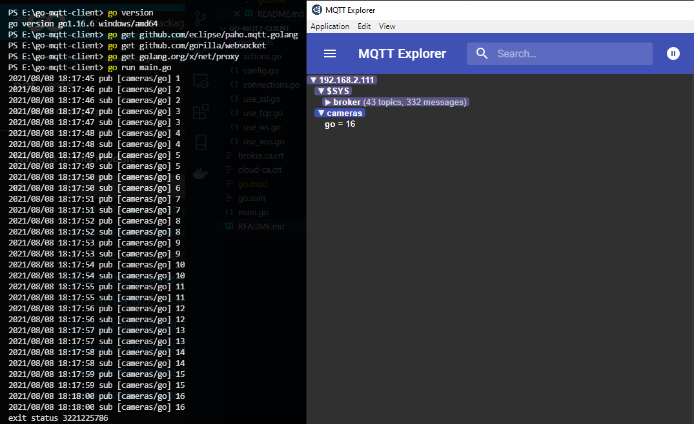

# Go Paho MQTT Client

In this example we provide example code for TCP, Websocket, TLS, and Websockets protocols to connect to the MQTT Broker. For more documentation on the use of the go paho-mqtt client, see the [Go Client - documentation](https://godoc.org/github.com/eclipse/paho.mqtt.golang)


<!-- TOC -->

- [Prerequisites](#prerequisites)
- [Installation](#installation)
- [Run](#run)
    - [Parameter](#parameter)

<!-- /TOC -->


## Prerequisites

```bash
go version

go version go1.16.6 windows/amd64
```

## Installation

* __github.com/eclipse/paho.mqtt.golang__: `v1.3.5`
* __github.com/gorilla/websocket__: `v1.4.2`
* __golang.org/x/net__: `v0.0.0-20210805182204-aaa1db679c0d`


```shell script
go get github.com/eclipse/paho.mqtt.golang
go get github.com/gorilla/websocket
go get golang.org/x/net/proxy
```

## Run

Add your broker data to `.main.go`:


```go
var Host     = flag.String("host", "192.168.2.111", "server hostname or IP")
var Port     = flag.Int("port", 8885, "server port")
var Action   = flag.String("action", "pubsub", "pub/sub/pubsub action")
var Protocol = flag.String("protocol", "ws", "mqtt/mqtts/ws/wss")
var Topic    = flag.String("topic", "cameras/go", "publish/subscribe topic")
var Username = flag.String("username", "admin", "mqtt broker username")
var Password = flag.String("password", "instar", "mqtt broker password")
var Qos      = flag.Int("qos", 1, "MQTT QOS")
var Tls      = flag.Bool("tls", false, "Enable TLS/SSL")
var CaCert   = flag.String("cacert", "./broker.ca.crt", "tls certificate")
```


> In the example above I am using [this Mosquitto broker](https://mpolinowski.github.io/devnotes/2021-06-02--mqtt-cheat-sheet) with active [Websocket interface](https://mpolinowski.github.io/devnotes/2021-06-01--mqtt-with-reactjs#activating-websockets).


```shell script
go run main.go
```





### Parameter

You can also override the default values by adding those parameters to the run command:


```shell script
go run main.go -host "192.168.2.111" -port 8885 -protocol 'ws' -action 'pubsub' -topic 'cameras/go' -qos 1 -username 'admin' -password 'instar' -tls false -cacert './broker.ca.crt'
```